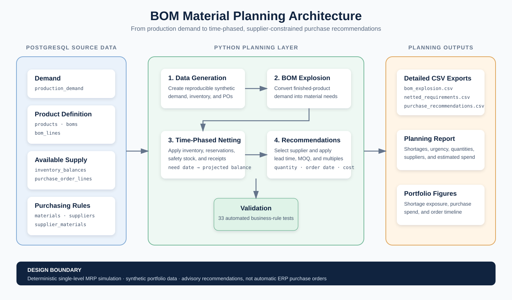

# BOM Material Planning

> **Status:** Core deterministic planning workflow implemented

## Overview

The BOM Material Planning project simulates how an aerospace manufacturer can
translate a production plan into actionable material-purchasing
recommendations.

The project will combine finished-product demand, bills of materials (BOMs),
inventory balances, open purchase orders, supplier lead times, safety stock,
and purchasing constraints to answer two practical questions:

> How much material should purchasing order, and when should each order be
> placed?

This is an independent portfolio project focused on material requirements
planning. It will use synthetic data and will not depend on the Manufacturing
Intelligence Platform database or code.

## Business Problem

Manufacturing planners may receive a production plan that identifies which
finished products are required and when they are needed. Purchasing cannot act
on that plan directly because finished-product quantities must first be
translated into raw-material requirements.

The calculation must account for:

- the material recipe for each product;
- expected material loss during production;
- current usable and reserved inventory;
- safety-stock requirements;
- open purchase orders and expected receipt dates;
- supplier lead times;
- minimum order quantities; and
- required order multiples.

Without an integrated calculation, planners risk ordering too little, ordering
too late, or purchasing unnecessary inventory.

## Business Questions

The first version will answer:

1. What materials are required for the current production plan?
2. How much of each material is required and when is it needed?
3. How much usable inventory is available after reservations and safety stock?
4. Which open purchase orders are expected to arrive before the material need
   date?
5. Which materials are projected to become short?
6. How much material should purchasing order?
7. When should each recommended order be placed?
8. Which recommendations are already urgent because the order date has passed?

## Planning Workflow



The architecture separates PostgreSQL source data from the Python planning
logic and its reporting outputs. This makes each calculation stage independently
testable while keeping the database as the planning system of record.

```text
Production demand
        ↓
Explode finished-product BOMs
        ↓
Calculate gross material requirements
        ↓
Account for expected process loss
        ↓
Subtract usable inventory and timely purchase receipts
        ↓
Protect required safety stock
        ↓
Calculate net material requirements
        ↓
Apply supplier MOQ and order-multiple constraints
        ↓
Recommend purchase quantity and order date
```

## Current Results

The reproducible planning run currently processes:

- 48 finished-product demand lines across six aerospace fastener products;
- 10 purchased materials and six approved or conditional suppliers;
- 176 detailed demand-to-BOM-component requirements;
- time-phased inventory and scheduled purchase receipts; and
- supplier-constrained recommendations using lead time, MOQ, and order
  multiples.

Run the complete material plan from the project root:

```bash
python -m src.planning.report
```

The command prints a purchasing summary and recreates three detailed files in
`outputs/planning/`:

```text
bom_explosion.csv
netted_material_requirements.csv
purchase_recommendations.csv
```

[View the complete planning results and figures](docs/planning_results.md)

See [`docs/planning_logic.md`](docs/planning_logic.md) for the formulas,
time-phased netting sequence, purchasing constraints, and limitations.

Recreate the planning figures:

```bash
python -m src.planning.create_results_figures
```

Generate or safely skip the three planning source datasets:

```bash
python -m src.generate_data
```

Run the automated business-rule tests:

```bash
python -m pytest -q
```

## Minimum Viable Scope

The initial implementation will use deterministic planning logic and
single-level BOMs. Each finished product will reference its raw materials
directly; intermediate subassemblies will not have separate BOMs in the first
version.

The project will include:

- a normalized PostgreSQL schema;
- realistic synthetic master and planning data;
- Python and SQL data-processing logic;
- single-level BOM explosion;
- time-phased gross and net material requirements;
- inventory and open-purchase-order netting;
- supplier purchasing constraints;
- purchase recommendations and urgency flags;
- data-quality checks and pytest coverage;
- a reproducible planning report; and
- project documentation describing formulas, assumptions, and limitations.

## Initial Data Model

### Master data

| Table | Purpose |
|---|---|
| `products` | Finished products included in the production plan |
| `materials` | Purchased raw materials and their units of measure |
| `suppliers` | Approved material suppliers |
| `bills_of_materials` | BOM header and revision for each finished product |
| `bom_components` | Material quantity and expected loss for each BOM line |
| `supplier_materials` | Supplier lead time, price, MOQ, and order multiple by material |

### Planning and transactional data

| Table | Purpose |
|---|---|
| `production_demand` | Planned finished-product quantities and required dates |
| `inventory_balances` | On-hand, reserved, restricted, and safety-stock quantities |
| `purchase_orders` | Open material orders and expected receipt dates |

Purchase recommendations will initially be a calculated analytical result
rather than manually seeded source data.

## Core Business Rules

### BOM requirements

- Each active finished product must have one active BOM revision.
- Each BOM component must reference a valid material.
- Required quantities must use explicit units of measure.
- Gross material demand must include the documented expected-loss allowance.
- Duplicate material lines within one BOM revision are not allowed.

### Inventory availability

- Only usable inventory can satisfy production demand.
- Reserved and restricted quantities are not generally available for new
  requirements.
- Safety stock must remain protected after planned demand is fulfilled.
- Available quantity cannot be treated as negative.

### Scheduled receipts

- Only open purchase-order quantities are considered.
- A receipt can satisfy a requirement only when its expected receipt date is
  on or before the material need date.
- Cancelled or already received purchase orders are excluded from future
  scheduled receipts.

### Purchase recommendations

- Net requirements cannot be negative.
- Recommended quantities must satisfy the supplier's minimum order quantity.
- Quantities above the minimum must be rounded up to the required order
  multiple.
- Recommended order dates must subtract supplier lead time from the material
  need date.
- Recommendations with order dates before the planning date must be flagged as
  urgent or past due.

## Important Definitions

### Single-level BOM

A single-level BOM lists the raw materials directly required for one finished
product. It does not include intermediate assemblies with their own BOMs.

### BOM explosion

BOM explosion converts finished-product demand into component or material
requirements by multiplying planned product quantities by the quantity of each
component required per finished unit.

### Gross requirement

The total material quantity required before considering inventory or scheduled
receipts.

### Net requirement

The remaining shortage after accounting for usable inventory, protected safety
stock, and purchase orders expected to arrive in time.

## Deliberate First-Version Boundaries

The first release will not include:

- multi-level or recursive BOMs;
- statistical demand forecasting;
- supplier-allocation optimization;
- detailed production scheduling;
- machine-capacity planning;
- dynamic safety-stock optimization;
- automated purchase-order creation;
- LLM-generated recommendations; or
- a deployed production service.

These capabilities can be added after the deterministic planning calculations
are validated. Forecasting should estimate future finished-product demand;
the planning engine should then translate that forecast into material needs.
An LLM may eventually summarize shortage risks, but it should not replace the
underlying calculations.

## Planned Technology Stack

- Python
- SQL
- PostgreSQL
- SQLAlchemy Core
- Pandas
- pytest
- Matplotlib
- Git

## Planned Delivery Stages

1. Confirm the data model and calculation definitions.
2. Create the PostgreSQL schema and seed master data.
3. Generate production demand, inventory, and purchase-order data.
4. Implement and validate single-level BOM explosion.
5. Implement time-phased inventory and scheduled-receipt netting.
6. Generate constrained purchase recommendations.
7. Add tests, analytical outputs, and documentation.
8. Evaluate multi-level BOM and demand-forecasting enhancements.
