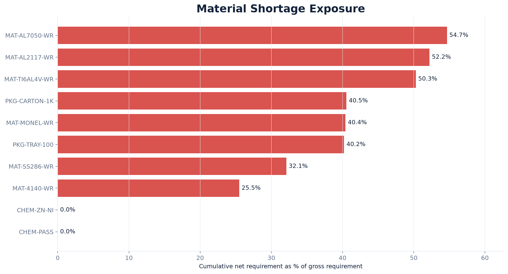
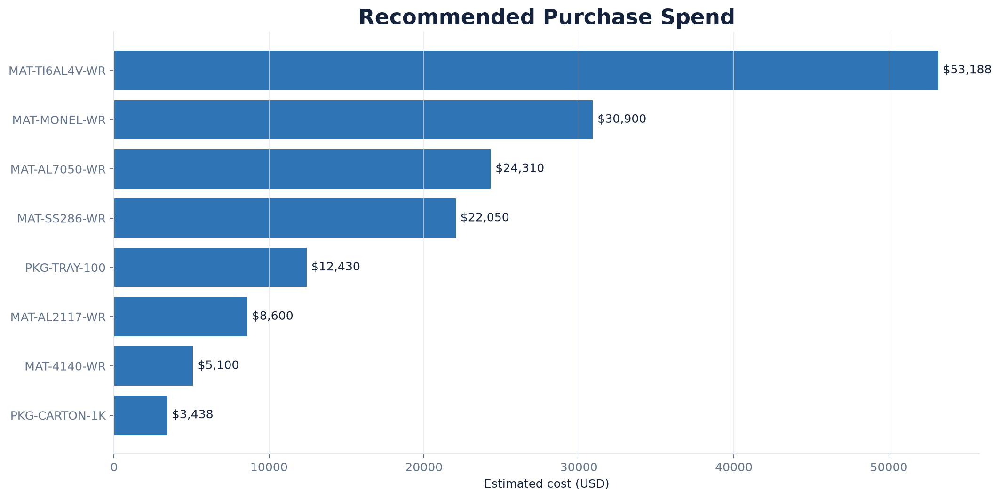
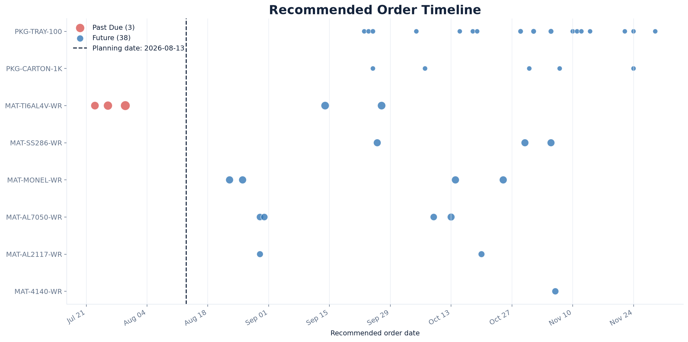

# BOM Material Planning Results

## Purpose

This report presents a reproducible snapshot of the deterministic planning
engine using synthetic aerospace-fastener demand and supply data. The results
were calculated on August 13, 2026 and are not measurements from a real
manufacturer.

Run the report and recreate the source CSV files:

```bash
python -m src.planning.report
```

Recreate the figures embedded below:

```bash
python -m src.planning.create_results_figures
```

## Executive Planning Summary

| Measure | Result |
|---|---:|
| Open finished-product demand lines | 48 |
| Materials planned | 10 |
| Detailed BOM requirement rows | 176 |
| Materials with projected shortages | 8 |
| Purchase recommendations | 41 |
| Past-due recommendations | 3 |
| Estimated recommended spend | $160,015.00 |

## Material Shortage Exposure



Shortage exposure is the cumulative net requirement divided by gross material
demand. It provides a unit-independent comparison across kilograms, liters,
and eaches.

- Process chemicals are covered by usable inventory and scheduled receipts.
- Packaging has the largest absolute shortages, but its unit cost is low.
- Aluminum, titanium, Monel, stainless steel, and alloy steel all require
  additional supply during the planning horizon.

## Recommended Purchasing by Material

| Material | UOM | Gross requirement | Cumulative net requirement | Recommendations | Recommended quantity | Estimated cost | Past due |
|---|---|---:|---:|---:|---:|---:|---:|
| MAT-TI6AL4V-WR | KG | 2,213.543 | 1,113.315 | 5 | 1,150.000 | $53,187.50 | 3 |
| MAT-MONEL-WR | KG | 1,919.587 | 775.743 | 4 | 1,000.000 | $30,900.00 | 0 |
| MAT-AL7050-WR | KG | 2,983.334 | 1,630.784 | 4 | 1,700.000 | $24,310.00 | 0 |
| MAT-SS286-WR | KG | 2,149.844 | 690.387 | 3 | 900.000 | $22,050.00 | 0 |
| PKG-TRAY-100 | EA | 27,045.229 | 10,877.447 | 17 | 11,300.000 | $12,430.00 | 0 |
| MAT-AL2117-WR | KG | 1,179.846 | 616.073 | 2 | 1,000.000 | $8,600.00 | 0 |
| MAT-4140-WR | KG | 1,728.866 | 440.793 | 1 | 750.000 | $5,100.00 | 0 |
| PKG-CARTON-1K | EA | 2,704.521 | 1,096.644 | 5 | 1,250.000 | $3,437.50 | 0 |
| CHEM-PASS | L | 89.372 | 0.000 | 0 | 0.000 | $0.00 | 0 |
| CHEM-ZN-NI | L | 49.404 | 0.000 | 0 | 0.000 | $0.00 | 0 |

### Material Code Key

The codes are synthetic ERP-style identifiers. Their prefixes describe the
material type, while the remaining segments identify the alloy, process, or
package form.

| Code | Meaning |
|---|---|
| `MAT-TI6AL4V-WR` | Ti-6Al-4V titanium wire (`MAT` = material, `WR` = wire) |
| `MAT-MONEL-WR` | Monel 400 nickel-copper alloy wire |
| `MAT-AL7050-WR` | 7050-T73 aluminum wire |
| `MAT-SS286-WR` | A-286 stainless-steel wire (`SS` = stainless steel) |
| `MAT-AL2117-WR` | 2117-T4 aluminum wire |
| `MAT-4140-WR` | 4140 alloy-steel wire |
| `PKG-TRAY-100` | Reusable packaging tray holding 100 fasteners |
| `PKG-CARTON-1K` | Packaging carton holding 1,000 fasteners |
| `CHEM-PASS` | Nitric passivation solution |
| `CHEM-ZN-NI` | Zinc-nickel plating solution |

Units of measure: `KG` = kilograms, `EA` = individual units, and `L` =
liters. The alloy designations—such as Ti-6Al-4V, 7050, 2117, A-286, and
4140—are industry material grades rather than quantities.

The recommended quantity can exceed the cumulative net requirement because
supplier MOQs and order multiples constrain purchase quantities. Excess supply
from one recommendation is carried forward before another order is proposed.

## Recommended Spend



Titanium accounts for the largest recommended spend despite packaging having
the largest unit quantity shortage. This illustrates why planners need both
quantity exposure and financial exposure rather than ranking materials by raw
quantity alone.

The four highest-cost materials—titanium, Monel, 7050 aluminum, and A-286
stainless steel—represent most of the $160,015 estimated spend.

## Order Timeline and Urgency



Three titanium recommendations are past due. Titanium Source Partners has a
56-day lead time, so standard delivery no longer supports those need dates as
of the planning snapshot.

A planner would need to consider:

- expediting with the preferred supplier;
- qualifying or using an alternate source;
- reallocating available titanium;
- revising the production schedule; or
- accepting a documented shortage risk.

The model flags the condition but does not automatically choose among these
business responses.

## Interpretation and Limitations

- Results are based on synthetic demand, inventory, receipts, prices, and lead
  times.
- Cumulative net requirement represents shortages before MOQ and
  order-multiple rounding.
- Estimated cost excludes freight, price breaks, taxes, and contract terms.
- A recommendation is advisory and is not an automatically created purchase
  order.
- Supplier capacity, variable lead time, and forecast uncertainty are not yet
  modeled.
- See [`planning_logic.md`](planning_logic.md) for formulas and detailed
  assumptions.
