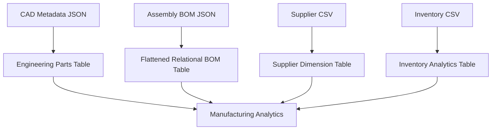

# CAD-to-ERP Engineering Data Pipeline

<p align="center">
  
  
  
  
</p>

## Overview

This project simulates a real-world aerospace manufacturing and engineering data pipeline that integrates CAD/PLM-style engineering metadata with ERP and inventory-style operational datasets.

The pipeline extracts engineering source exports, generates scalable synthetic manufacturing datasets, validates manufacturing data quality, transforms nested Bill of Materials (BOM) structures into relational tables, and produces analytics-ready datasets for downstream reporting and operational workflows.

This project was designed to simulate engineering/manufacturing data environments commonly found in:
- aerospace manufacturing
- defense contractors
- CAD/PLM systems
- ERP systems
- manufacturing analytics platforms

---

# Pipeline Architecture


---

# Engineering Data Workflow



---

# Key Features

- Extracts engineering and manufacturing source exports
- Generates scalable synthetic aerospace manufacturing datasets
- Processes JSON and CSV operational datasets
- Validates engineering metadata and supplier relationships
- Flattens nested BOM structures into relational tables
- Produces analytics-ready manufacturing datasets
- Simulates CAD-to-ERP engineering workflows
- Demonstrates modular ETL pipeline architecture
- Implements inventory business-rule transformations
- Simulates operational-scale manufacturing environments

---

# Synthetic Operational Scaling

The project includes a synthetic scaling layer that expands seed engineering exports into larger operational manufacturing datasets.

This allows the pipeline to simulate:
- large aerospace part inventories
- multi-assembly manufacturing relationships
- operational warehouse inventory tracking
- ERP-style manufacturing datasets
- scalable relational manufacturing workflows

Example scaling:
- hundreds of engineering parts
- dozens of assemblies
- large relational BOM relationships
- expanded inventory operations

This simulates how engineering metadata may evolve into larger operational manufacturing datasets inside real enterprise environments.

---

# Example Engineering Transformation

One major transformation performed by the pipeline is converting nested engineering BOM structures into relational manufacturing tables.

## Source Engineering BOM Structure

```json
{
  "assembly_id": "ASM-001",
  "parts": [
    {
      "part_number": "KSD-AER-1001",
      "quantity": 1
    }
  ]
}
```

## Flattened Relational Output

| assembly_id | part_number | quantity |
|---|---|---|
| ASM-001 | KSD-AER-1001 | 1 |

This transformation is highly relevant to:
- ERP systems
- manufacturing databases
- engineering analytics
- aerospace assembly tracking
- relational SQL workflows

---

# Inventory Business Logic

The pipeline derives operational analytics fields from raw inventory exports.

Example:

```python
below_reorder_level = stock_quantity < reorder_level
```

This simulates real-world ERP inventory monitoring and procurement alert workflows.

---

# Project Structure

```text
cad_erp_pipeline/
├── data
│   ├── source
│   ├── raw
│   └── processed
├── images
├── logs
├── sql
├── src
│   ├── config.py
│   ├── extract.py
│   ├── generate_data.py
│   ├── load.py
│   ├── main.py
│   ├── transform.py
│   └── validate.py
├── README.md
└── requirements.txt
```

---

# Source Data Files

| File | Purpose |
|---|---|
| `cad_parts_export.json` | Simulated CAD/PLM engineering metadata export |
| `assembly_bom_export.json` | Nested engineering Bill of Materials (BOM) structures |
| `suppliers_export.csv` | ERP supplier and procurement data |
| `inventory_export.csv` | Inventory and warehouse operational data |

---

# Raw Operational Outputs

The synthetic scaling layer generates larger operational manufacturing datasets inside:

```text
data/raw/
```

Generated datasets include:
- large engineering parts datasets
- expanded assembly relationships
- operational inventory records
- relational manufacturing BOM tables

These datasets simulate operational-scale aerospace manufacturing environments.

---

# Processed Outputs

| Output File | Description |
|---|---|
| `parts_processed.csv` | Cleaned engineering part metadata |
| `bom_processed.csv` | Flattened relational BOM table |
| `suppliers_processed.csv` | Standardized supplier dataset |
| `inventory_processed.csv` | Inventory analytics dataset with derived business logic |

---

# Technologies Used

- Python
- Pandas
- PostgreSQL
- SQL
- JSON
- CSV
- ETL Pipelines
- Data Validation
- Relational Modeling

---

# Data Validation Checks

The pipeline validates:
- required columns
- missing values
- duplicate part numbers
- invalid engineering statuses
- negative inventory values
- missing supplier relationships

---

# Data Sources

This project currently uses synthetic engineering and manufacturing metadata to simulate aerospace and CAD-to-ERP operational workflows.

In production environments, similar data is commonly sourced from:
- CAD/PLM platforms
- ERP systems
- manufacturing databases
- engineering BOM exports
- supplier and inventory systems

Example public datasets and references:
- https://www.kaggle.com/datasets/shivamb/machine-predictive-maintenance-classification
- https://www.kaggle.com/datasets/amirmotefaker/supply-chain-dataset

---

# Future Improvements

- PostgreSQL database integration
- Automated SQL analytics reporting
- Airflow workflow orchestration
- Engineering revision history tracking
- Supplier lead-time analytics
- Inventory forecasting
- Manufacturing KPI dashboards
- Real-time manufacturing event streaming