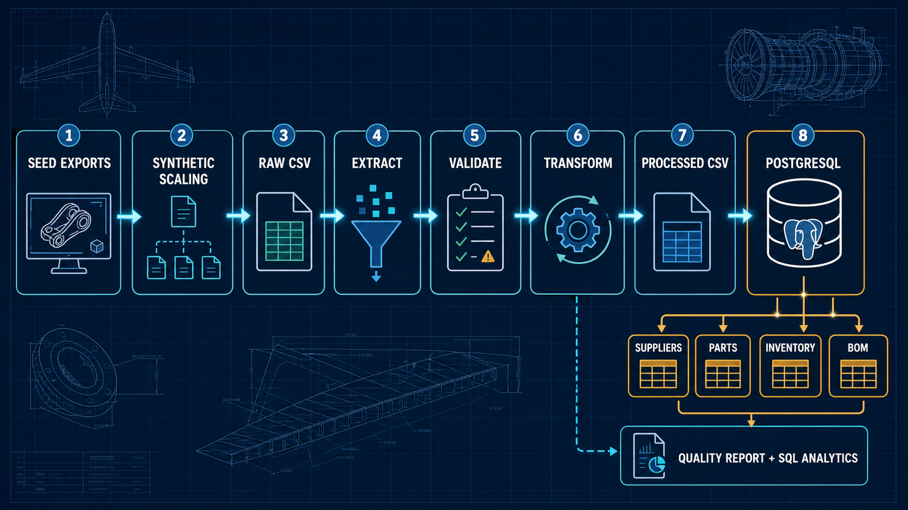
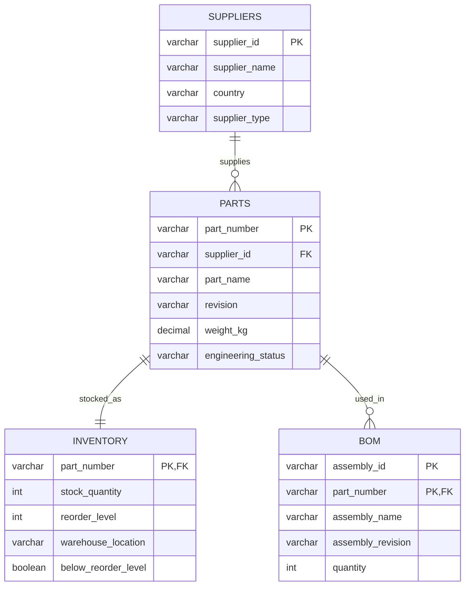

# CAD-to-ERP Engineering Data Pipeline

A portfolio-scale ETL project that simulates moving aerospace CAD/PLM parts,
assembly BOMs, suppliers, and inventory data into cleaned relational CSVs and
PostgreSQL.

The project intentionally stays focused on engineering-data integration. It
does not perform forecasting, inventory optimization, purchase recommendations,
production scheduling, machine learning, or LLM processing.

## Pipeline

```text
data/source seed JSON/CSV exports
    -> deterministic synthetic scaling
    -> data/raw operational CSVs
    -> extraction and validation
    -> transformation
    -> data/processed relational CSVs
    -> atomic PostgreSQL full refresh
    -> data-quality report and SQL analytics
```



The default random seed (`42`) makes generated data reproducible. A complete
run currently produces:

| Dataset | Rows | Destination |
|---|---:|---|
| Parts | 250 | `parts` |
| Suppliers | 4 | `suppliers` |
| Inventory | 250 | `inventory` |
| BOM relationships | 222 | `bom` |
| Assembly metadata | 40 | Raw intermediate only |

Assembly metadata is used to generate BOM relationships but is not a fifth
database table. The database scope remains the four tables above.

### Relational model



## What the pipeline demonstrates

- JSON and CSV seed ingestion
- Reproducible synthetic operational data generation
- Flat relational extraction from `data/raw/`
- Required-column, null, identifier, numeric, and reference validation
- Normalization of engineering, supplier, inventory, and BOM fields
- Flattening of nested seed BOM structures through a reusable transformation
- A derived `below_reorder_level` flag (`stock_quantity < reorder_level`)
- Processed CSV delivery
- Transactional, dependency-ordered PostgreSQL full refreshes
- Data-quality reporting based on actual validation results
- SQL examples for supplier exposure, shared parts, and assembly inventory risk

## Project structure

```text
cad_erp_pipeline/
├── data/
│   ├── source/       # tracked seed exports
│   ├── raw/          # generated and ignored
│   └── processed/    # generated and ignored
├── logs/             # generated and ignored
├── images/
│   └── cad_erp_pipeline_execution.png
├── sql/
│   ├── schema.sql
│   └── analytics_queries.sql
├── src/
│   ├── config.py
│   ├── extract.py
│   ├── generate_data.py
│   ├── load.py
│   ├── main.py
│   ├── report.py
│   ├── transform.py
│   └── validate.py
├── tests/
├── .gitignore
├── README.md
└── requirements.txt
```

## Setup

Use Python 3.10 or newer.

```bash
python -m venv .venv
source .venv/bin/activate
python -m pip install -r requirements.txt
```

Create a local `.env` file. It is excluded from Git and its values should not
be printed or committed.

```dotenv
DB_USER=your_user
DB_PASSWORD=your_password
DB_HOST=localhost
DB_PORT=5432
DB_NAME=your_database
```

Create the four tables once, against the intended database:

```bash
psql -U your_user -d your_database -f sql/schema.sql
```

`schema.sql` drops and recreates only `bom`, `inventory`, `parts`, and
`suppliers`, in dependency-safe order. Review the target database before
running it.

## Run the complete pipeline

From the project root:

```bash
python -m src.main
```

That single command regenerates raw data, extracts it, validates it, transforms
it, writes processed CSVs and the quality report, and refreshes PostgreSQL.

The database refresh truncates exactly `bom`, `inventory`, `parts`, and
`suppliers`, then inserts suppliers, parts, inventory, and BOM rows. The
truncate and all inserts share one transaction; an insert failure rolls the
entire refresh back.

To generate only the raw layer:

```bash
python -m src.generate_data
```

## Validation and quality reporting

The pipeline checks:

- required columns and missing values in every raw dataset
- unique part, supplier, inventory, and assembly identifiers
- unique `(assembly_id, part_number)` BOM relationships
- valid engineering statuses
- positive part weights and BOM quantities
- nonnegative stock quantities and reorder levels
- valid supplier references from parts
- valid part references from BOM and inventory

The generated report is `logs/data_quality_report.txt`. Its validation section
lists each check and derives the final `PASSED` or `FAILED` status from those
results. On a validation failure, the report is written before the pipeline
stops.

## Tests

```bash
python -m pytest -q
```

Tests cover raw extraction, deterministic scaling, transformations, nested BOM
flattening, validation success and failure cases, reference integrity, reorder
flags, and quality-report status.

## SQL analytics

After a successful load, run the examples in `sql/analytics_queries.sql` to
inspect supplier inventory exposure, parts shared across assemblies, and
assembly components below reorder level.

## Limitations

- Data is synthetic and generated from four small seed exports.
- The loader is intentionally a local-development full refresh, not an
  incremental or production ingestion design.
- Assembly revision history, effectivity dates, alternate parts, units of
  measure, and multi-level assembly-to-assembly BOMs are outside this project.
- The reorder flag is descriptive only; it is not a purchasing recommendation
  or an optimization feature.
- PostgreSQL tables must exist before the pipeline runs.
