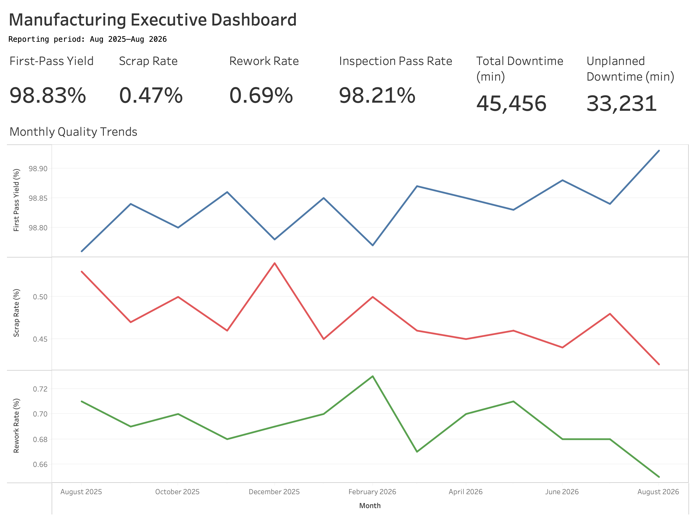

# Manufacturing Intelligence Platform

> 🚧 **Status:** In Development

## Overview

The Manufacturing Intelligence Platform is an end-to-end manufacturing analytics platform designed to simulate a modern aerospace manufacturing environment. The project integrates operational data from Enterprise Resource Planning (ERP), Manufacturing Execution Systems (MES), Quality Management Systems (QMS), Inventory Management, Maintenance Records, and Industrial IoT Sensors into a centralized PostgreSQL data warehouse.

Built using modern data engineering and analytics practices, the platform demonstrates how organizations can transform fragmented manufacturing data into actionable business intelligence, predictive insights, and operational decision support.

---

# Executive Dashboard



The Tableau executive dashboard summarizes plant-level first-pass yield, scrap,
rework, inspection performance, downtime, and monthly quality trends. The
packaged workbook includes its local analytics data extracts and can be
downloaded here:

[Download the Tableau packaged workbook](tableau/manufacturing_intelligence_dashboard.twbx)

---

# Business Problem

Modern manufacturing facilities generate large volumes of operational data across multiple business systems. ERP systems manage production orders and inventory, MES systems capture machine activity, quality systems record inspection results, maintenance systems track equipment servicing, and industrial sensors continuously monitor machine health.

Although each system provides valuable information independently, these data sources often exist in isolation. This fragmentation makes it difficult for engineers, production managers, and plant leadership to answer critical operational questions, including:

- Why did scrap increase yesterday?
- Which machines experience the most downtime?
- Which production lines consistently achieve the highest first-pass yield?
- Are equipment failures preceded by abnormal sensor readings?
- Which suppliers are associated with higher defect rates?
- What operational factors have the greatest impact on Overall Equipment Effectiveness (OEE)?

This project simulates the role of a Manufacturing Data Scientist responsible for designing a unified analytics platform that consolidates these operational systems into a centralized environment for reporting, root cause analysis, and predictive analytics.

---

# Project Goals

The primary objectives of this project are to:

- Design a normalized PostgreSQL database for manufacturing operations.
- Simulate realistic manufacturing datasets across multiple operational systems.
- Build automated ETL pipelines using Python.
- Calculate key manufacturing performance indicators (KPIs).
- Develop interactive operational dashboards.
- Perform root cause analysis of production losses.
- Build predictive machine learning models using manufacturing data.
- Demonstrate software engineering best practices through modular, maintainable code.

---

# Simulated Manufacturing Environment

This project models a vertically integrated aerospace fastener manufacturer responsible for producing high-precision fastening systems used within the aerospace industry.

The simulated manufacturing process includes:

```text
Raw Material
      ↓
Cold Heading
      ↓
Thread Rolling
      ↓
Heat Treatment
      ↓
Surface Finishing
      ↓
Assembly
      ↓
Quality Inspection
      ↓
Packaging
```

Each production order progresses through multiple manufacturing operations while generating production, quality, inventory, maintenance, and machine sensor data.

---

# Data Sources

The platform integrates simulated data from several manufacturing systems.

| System | Description |
|----------|-------------|
| ERP | Production orders, customers, inventory, suppliers |
| MES | Machine events, cycle times, production history, downtime |
| Quality Management | Inspections, defects, measurements, first-pass yield |
| Inventory | Material lots, finished goods, warehouse transactions |
| Maintenance | Preventive maintenance, repairs, equipment history |
| Industrial IoT | Temperature, vibration, power consumption, pressure, RPM |

---

# Project Architecture

```
ERP
MES
Quality
Inventory
Maintenance
IoT Sensors
        │
        ▼
Python ETL Pipelines
        │
        ▼
PostgreSQL Data Warehouse
        │
        ├──────────────► SQL Analytics
        ├──────────────► KPI Calculations
        ├──────────────► Tableau Dashboards
        └──────────────► Machine Learning Models
```

---

# Manufacturing KPIs

The platform will calculate and monitor operational metrics including:

- Overall Equipment Effectiveness (OEE)
- First Pass Yield (FPY)
- Scrap Rate
- Downtime
- Cycle Time
- Throughput
- Capacity Utilization
- Defect Rate
- Inventory Accuracy

Run the manufacturing analytics report:

```bash
python -m src.analytics.kpis
```

Export dashboard-ready CSV datasets:

```bash
python -m src.analytics.export_dashboard_data
```

See [`docs/analytics_kpi_guide.md`](docs/analytics_kpi_guide.md) for each
report's business questions, source tables, join path, grain, formulas, and
limitations.

---

# Technology Stack

## Data Engineering

- Python
- SQL
- PostgreSQL
- Pandas

## Analytics

- Tableau
- Statistical Analysis
- Manufacturing KPIs

## Machine Learning

- Scikit-learn
- Predictive Analytics

---

# Project Roadmap

## Phase 1 — Data Architecture

- [x] Design Entity Relationship Diagram (ERD)
- [x] Design relational database schema
- [x] Define manufacturing entities and relationships

## Phase 2 — Data Generation

- [x] Generate realistic manufacturing datasets
- [x] Simulate ERP data
- [x] Simulate MES data
- [x] Simulate Quality data
- [x] Simulate Sensor data

## Phase 3 — ETL Pipeline

- [x] Extract
- [x] Transform
- [x] Load into PostgreSQL

## Phase 4 — Analytics

- [x] Manufacturing KPIs
- [ ] Root Cause Analysis
- [ ] Executive Dashboard

## Phase 5 — Machine Learning

- [ ] Predictive maintenance
- [ ] Defect prediction
- [ ] Downtime forecasting

## Future Enhancements

- AI-powered manufacturing assistant using Large Language Models (LLMs)
- Natural language querying of manufacturing data
- Predictive production recommendations
- Real-time streaming data integration
- Interactive manufacturing copilot

---

# Repository Structure

```
manufacturing-intelligence-platform/
├── data/
├── database/
├── docs/
├── notebooks/
├── src/
├── dashboard/
└── tests/
```

---

# License

This project is intended for educational and portfolio purposes.
