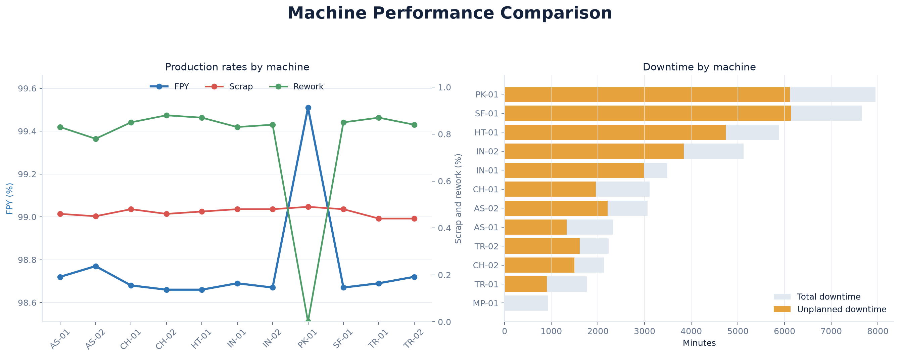
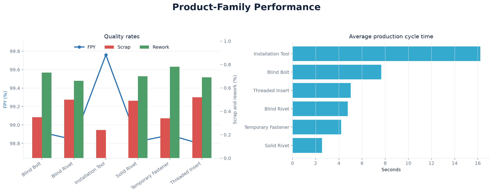
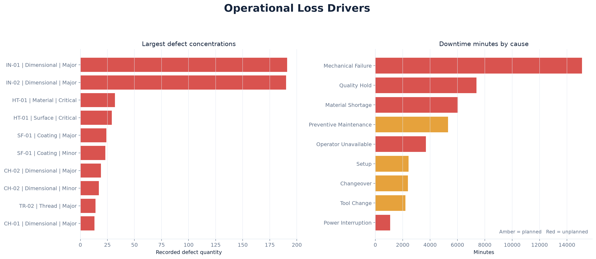
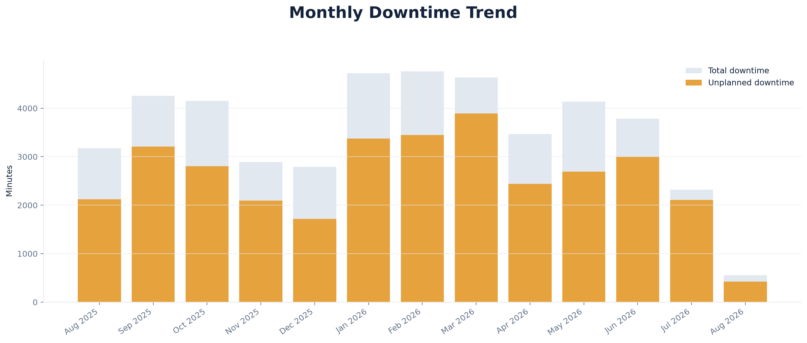

# Manufacturing Analytics Results

## Purpose

This report presents a portfolio snapshot of the implemented manufacturing
analytics layer. The results were calculated from synthetic PostgreSQL data on
August 5, 2026. They demonstrate the questions the analytical workflow can
answer; they are not measurements from a real manufacturing facility.

Reproduce the complete terminal report from the project root:

```bash
python -m src.analytics.kpis
```

Recreate the figures embedded in this report:

```bash
python -m src.analytics.create_results_figures
```

The queries use the current timestamp as an as-of boundary, so results can
change as generated events become historical records.

## Executive KPI Summary

The existing Tableau executive dashboard visualizes the plant-level KPI cards
and monthly quality trends. The Python figures below supplement that dashboard
with analyses it does not currently display.


| KPI | Result |
|---|---:|
| First-pass yield | 98.83% |
| Scrap rate | 0.47% |
| Rework rate | 0.69% |
| Inspection pass rate | 98.20% |
| Total downtime | 45,638 minutes |
| Unplanned downtime | 33,314 minutes |

The generated plant has high overall yield, but approximately 73% of recorded
downtime is unplanned. This makes equipment reliability and interruption
causes more actionable improvement areas than the plant-level scrap rate alone.

## Machine Performance



### Machine-code key

| Code | Machine | Manufacturing operation | Production area |
|---|---|---|---|
| CH-01 | Cold Header 1 | Cold Heading | Fastener Line A |
| CH-02 | Cold Header 2 | Cold Heading | Fastener Line B |
| TR-01 | Thread Roller 1 | Thread Rolling | Fastener Line A |
| TR-02 | Thread Roller 2 | Thread Rolling | Fastener Line B |
| HT-01 | Heat Treat Furnace 1 | Heat Treatment | Heat Treat Line |
| SF-01 | Surface Finishing 1 | Surface Finishing | Finishing Line |
| AS-01 | Assembly Cell 1 | Assembly | Assembly Line A |
| AS-02 | Assembly Cell 2 | Assembly | Assembly Line B |
| IN-01 | Inspection Station 1 | Inspection | Quality Lab |
| IN-02 | Inspection Station 2 | Inspection | Quality Lab |
| PK-01 | Packaging Line 1 | Packaging | Packaging Area |
| MP-01 | Multi-Purpose Cell 1 | Multi-Purpose | Prototype Line |

| Machine | Completed runs | FPY | Scrap | Rework | Downtime (min) | Unplanned (min) |
|---|---:|---:|---:|---:|---:|---:|
| AS-01 | 286 | 98.72% | 0.46% | 0.83% | 2,333 | 1,326 |
| AS-02 | 297 | 98.77% | 0.45% | 0.78% | 3,065 | 2,206 |
| CH-01 | 344 | 98.68% | 0.48% | 0.85% | 3,105 | 1,952 |
| CH-02 | 358 | 98.66% | 0.46% | 0.88% | 2,128 | 1,495 |
| HT-01 | 702 | 98.66% | 0.47% | 0.87% | 5,875 | 4,740 |
| IN-01 | 492 | 98.69% | 0.48% | 0.83% | 3,488 | 2,986 |
| IN-02 | 455 | 98.67% | 0.48% | 0.84% | 5,123 | 3,841 |
| MP-01 | 0 | N/A | N/A | N/A | 925 | 0 |
| PK-01 | 918 | 99.51% | 0.49% | 0.00% | 7,950 | 6,112 |
| SF-01 | 878 | 98.67% | 0.48% | 0.85% | 7,657 | 6,139 |
| TR-01 | 262 | 98.69% | 0.44% | 0.87% | 1,758 | 907 |
| TR-02 | 264 | 98.72% | 0.44% | 0.84% | 2,231 | 1,610 |

### Findings

- `PK-01` recorded the most total downtime at 7,950 minutes.
- `SF-01` recorded the most unplanned downtime at 6,139 minutes, narrowly
  exceeding `PK-01`.
- `PK-01` achieved the highest reported machine FPY at 99.51%.
- `MP-01` had no completed production runs, so production-rate comparisons are
  intentionally reported as unavailable rather than zero.

These are descriptive associations. High downtime totals can reflect greater
machine workload as well as reliability, so a true utilization-normalized
comparison would require planned machine schedules.

## Product-Family Performance



| Product family | Completed runs | FPY | Scrap | Rework | Avg. cycle time (sec) |
|---|---:|---:|---:|---:|---:|
| Blind Bolt | 1,387 | 98.92% | 0.35% | 0.73% | 7.65 |
| Blind Rivet | 956 | 98.84% | 0.50% | 0.66% | 4.76 |
| Installation Tool | 296 | 99.76% | 0.24% | 0.00% | 16.22 |
| Solid Rivet | 907 | 98.82% | 0.49% | 0.70% | 2.54 |
| Temporary Fastener | 677 | 98.89% | 0.34% | 0.78% | 4.20 |
| Threaded Insert | 1,033 | 98.79% | 0.52% | 0.69% | 5.02 |

Installation Tools have the highest FPY and the longest average cycle time in
the snapshot. Threaded Inserts have the lowest product-family FPY and the
highest scrap rate, making them a reasonable starting point for a more focused
process review.

## Largest Defect Concentrations



| Rank | Machine | Category | Severity | Defect records | Defect quantity |
|---:|---|---|---|---:|---:|
| 1 | IN-01 | Dimensional | Major | 131 | 191 |
| 2 | IN-02 | Dimensional | Major | 143 | 190 |
| 3 | HT-01 | Material | Critical | 26 | 32 |
| 4 | HT-01 | Surface | Critical | 23 | 29 |
| 5 | SF-01 | Coating | Major | 19 | 24 |

The two inspection machines contain the largest recorded defect quantities,
primarily major dimensional defects. This is a concentration report, not proof
that the inspection machines caused the defects; they are the operations where
those defects were detected and recorded.

## Downtime Cause Analysis

| Cause | Type | Events | Minutes | Avg. event (min) |
|---|---|---:|---:|---:|
| Mechanical Failure | Unplanned | 112 | 15,109 | 134.90 |
| Quality Hold | Unplanned | 77 | 7,387 | 95.94 |
| Material Shortage | Unplanned | 36 | 6,035 | 167.64 |
| Preventive Maintenance | Planned | 19 | 5,309 | 279.42 |
| Operator Unavailable | Unplanned | 54 | 3,702 | 68.56 |
| Setup | Planned | 45 | 2,427 | 53.93 |
| Changeover | Planned | 34 | 2,385 | 70.15 |
| Tool Change | Planned | 82 | 2,203 | 26.87 |
| Power Interruption | Unplanned | 14 | 1,081 | 77.21 |

Mechanical failures create the most downtime in aggregate. Material shortages
occur less often but have the longest average duration among unplanned causes,
which suggests a separate supply-chain improvement opportunity.

## Monthly Trend Snapshot

The Tableau dashboard displays monthly FPY, scrap, and rework. This Python
figure adds the missing monthly total and unplanned downtime view.



| Month | FPY | Scrap | Rework | Downtime (min) | Unplanned (min) |
|---|---:|---:|---:|---:|---:|
| Aug 2025 | 98.76% | 0.53% | 0.71% | 3,175 | 2,119 |
| Sep 2025 | 98.84% | 0.47% | 0.69% | 4,256 | 3,212 |
| Oct 2025 | 98.80% | 0.50% | 0.70% | 4,153 | 2,803 |
| Nov 2025 | 98.86% | 0.46% | 0.68% | 2,892 | 2,097 |
| Dec 2025 | 98.78% | 0.54% | 0.69% | 2,789 | 1,715 |
| Jan 2026 | 98.85% | 0.45% | 0.70% | 4,718 | 3,376 |
| Feb 2026 | 98.77% | 0.50% | 0.73% | 4,758 | 3,446 |
| Mar 2026 | 98.87% | 0.46% | 0.67% | 4,632 | 3,892 |
| Apr 2026 | 98.85% | 0.45% | 0.70% | 3,467 | 2,438 |
| May 2026 | 98.83% | 0.46% | 0.71% | 4,138 | 2,692 |
| Jun 2026 | 98.88% | 0.44% | 0.68% | 3,789 | 2,995 |
| Jul 2026 | 98.84% | 0.48% | 0.68% | 2,317 | 2,105 |
| Aug 2026 (partial) | 98.86% | 0.44% | 0.71% | 554 | 424 |

FPY remains within a narrow range across completed months. December 2025 has
the highest monthly scrap rate, while March 2026 has the most unplanned
downtime. August 2026 is explicitly marked as partial and should not be
compared with completed months without normalizing for elapsed time.

## Scope and Interpretation

- FPY is calculated at the production-operation grain, not as final
  finished-goods yield.
- The results are descriptive and do not establish causal relationships.
- True OEE is excluded because planned machine production time by shift is not
  available.
- Predictive-maintenance results are documented separately in
  [`ml_predictive_maintenance.md`](ml_predictive_maintenance.md).
- Query definitions, table joins, grains, and formulas are documented in
  [`analytics_kpi_guide.md`](analytics_kpi_guide.md).
